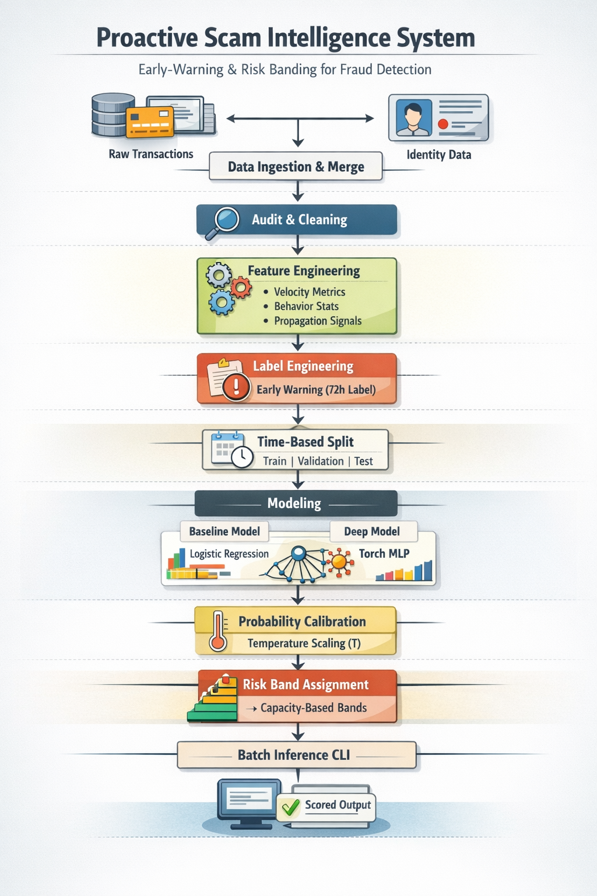
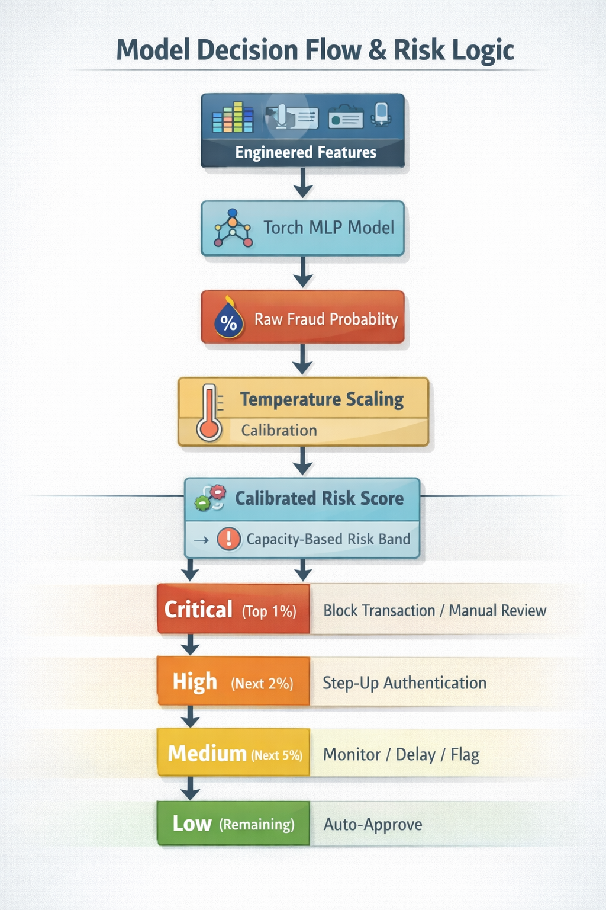
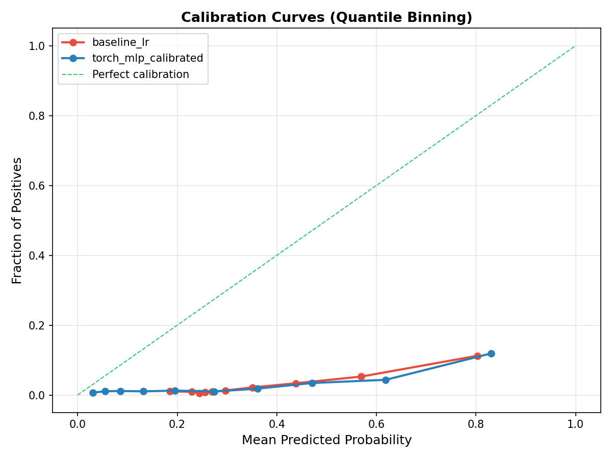
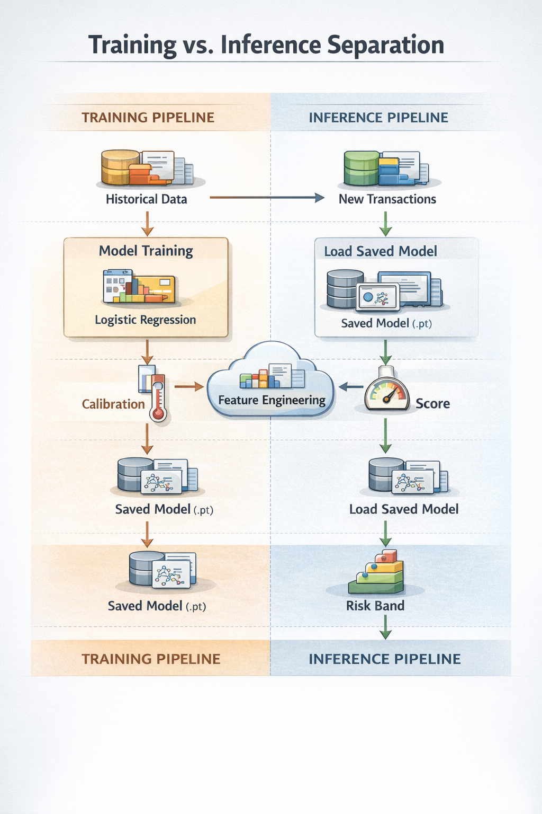
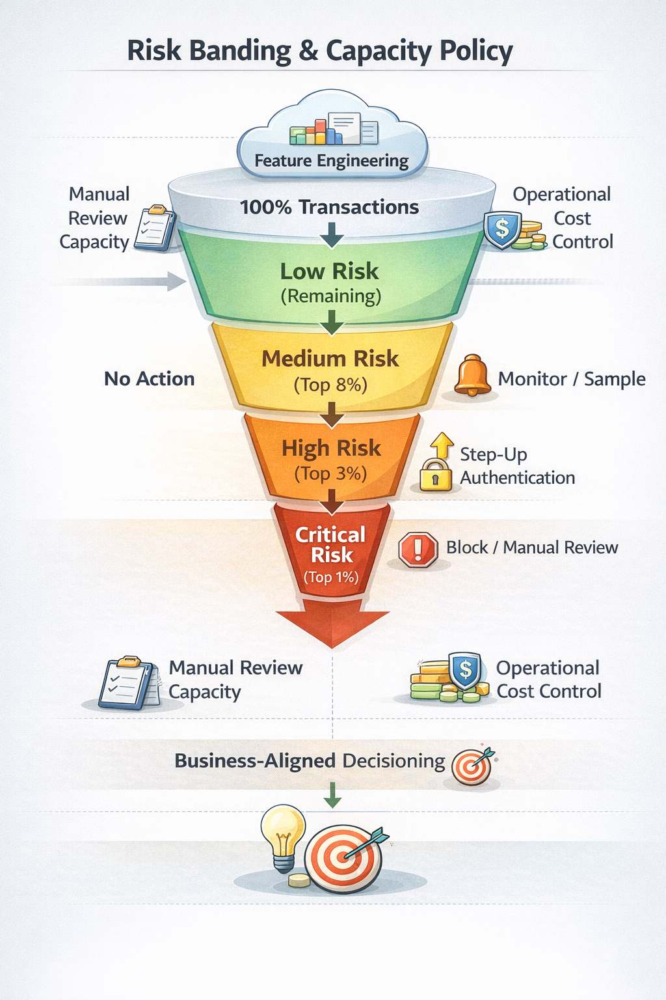
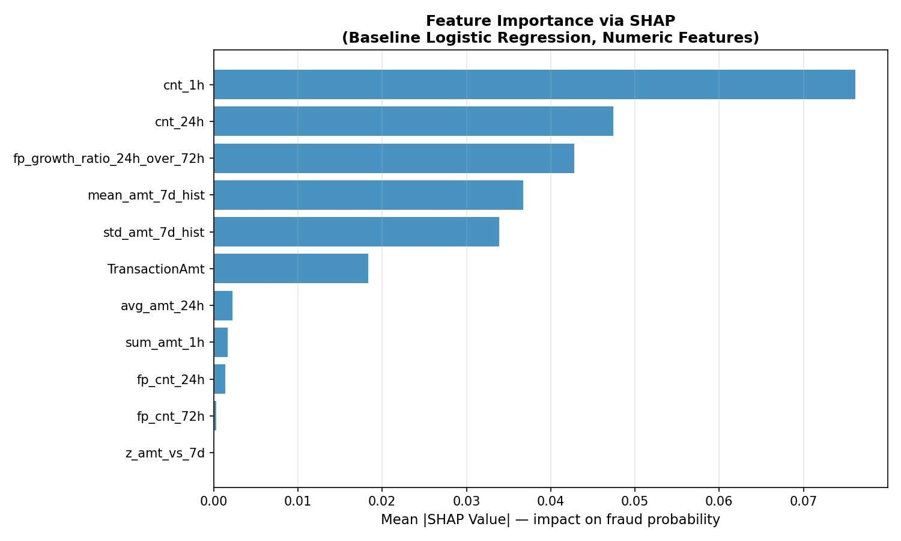
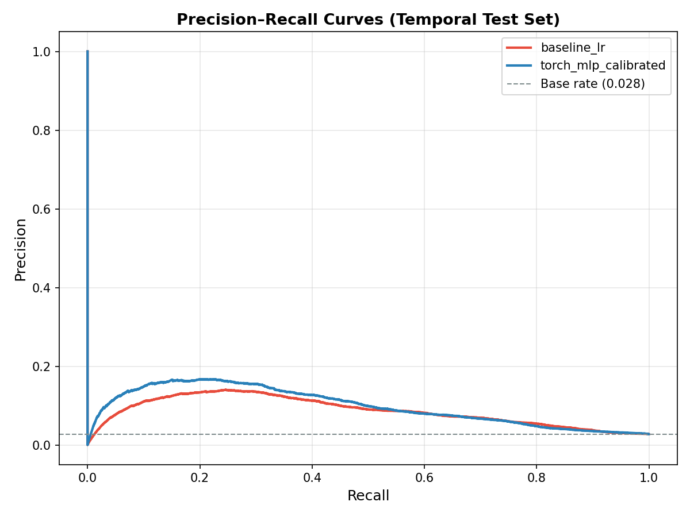

# FraudSentinel

Proactive payment fraud intelligence — early-warning risk scoring for operations teams.

[](https://python.org)
[](https://pytorch.org)
[](https://fastapi.tiangolo.com)
[](https://mlflow.org)
[](tests/)
[](LICENSE)
[](https://www.linkedin.com/in/rameshsta/)

---

FraudSentinel is an end-to-end machine learning system built on 590,540 real payment transactions from the IEEE-CIS dataset. It ranks every transaction by the probability that the originating entity will commit fraud within the next 72 hours, then assigns each transaction to a risk band that maps directly to an operational action. Reviewing only the top 8% of scored traffic captures **37.6% of all fraud** — a **4.7× improvement** over random review at the same cost.

---

## Live Reports

| Report | Description | Open |
|--------|-------------|------|
| **Drift Monitoring Dashboard** | Interactive per-feature distribution comparison, KS drift tests, score shift alert — powered by Evidently AI | [**Open Report**](https://rameshsta.github.io/fraudsentinel/reports/drift_monitoring_report.html) |
| **Precision-Recall Curves** | Model comparison on temporal test set | [View](reports/pr_curves.png) |
| **Calibration Curves** | Post-temperature-scaling calibration for both models | [View](reports/calibration_curves.png) |
| **SHAP Feature Importance** | Global attribution across 2,000 test samples | [View](reports/figures/shap_global_importance.png) |

---

## Contents

- [Background](#background)
- [The Problem with Standard Fraud Detection](#the-problem-with-standard-fraud-detection)
- [The Approach](#the-approach)
- [Results](#results)
- [System Architecture](#system-architecture)
- [Early-Warning Label](#early-warning-label)
- [Feature Engineering](#feature-engineering)
- [Models](#models)
- [Probability Calibration](#probability-calibration)
- [Training and Inference](#training-and-inference)
- [Risk Bands](#risk-bands)
- [Model Explainability](#model-explainability)
- [Precision-Recall Performance](#precision-recall-performance)
- [Drift Monitoring](#drift-monitoring)
- [Getting Started](#getting-started)
- [API Reference](#api-reference)
- [Engineering Practices](#engineering-practices)
- [Project Structure](#project-structure)
- [Technology Stack](#technology-stack)
- [Dataset](#dataset)
- [Author](#author)

---

## Background

Payment fraud costs the global financial system over $485 billion annually. Despite significant investment in machine learning, most fraud teams still review the wrong transactions. The root cause is not the model — it is the framing of the problem.

Standard fraud detection asks: *was this transaction fraudulent?* This is a reactive question. By the time a transaction is labelled fraudulent, the chargeback has been filed, the card has been used across multiple merchants, and the intervention window has closed. The model is accurate, but operationally useless for prevention.

At the same time, fraud operations teams work under a constraint that models routinely ignore: there is a fixed number of reviewers and a finite number of transactions they can assess each day. Without an intelligent ranking system, random sampling catches fraud at exactly the population base rate — 2.78% in this dataset. Every reviewer hour spent on a randomly selected transaction is a squandered opportunity.

FraudSentinel was built to solve both problems simultaneously.

---

## The Problem with Standard Fraud Detection

Most deployed fraud systems suffer from three structural weaknesses.

**Reactive labelling.** When a model is trained to detect confirmed fraudulent transactions, it learns to identify fraud after it has occurred. The features it finds most predictive — chargeback flags, confirmed device mismatch — are only available in hindsight. The model scores transactions that are already losses, not transactions that are about to become losses.

**Uncalibrated scores.** Neural networks and gradient boosting models are systematically overconfident. A raw model output of 0.85 does not mean 85% of such transactions are fraudulent — the actual observed rate may be far lower. Operations teams learn this quickly and stop trusting the model's numeric outputs, reverting to manual judgment. This defeats the purpose of the system.

**Threshold-based queuing.** Flagging every transaction above a fixed score threshold produces a review queue that overflows when score distributions shift upward and starves when they shift downward. Neither outcome is acceptable. The queue must always match team capacity, and it must always contain the highest-risk transactions — not the transactions that happen to exceed an arbitrary cutoff set at deployment.

---

## The Approach

FraudSentinel reframes the detection problem as a **ranking problem with a proactive label**.

Instead of asking whether a transaction is fraudulent, the system asks: **will this entity commit fraud within the next 72 hours?** This single change in label definition shifts the model's task from reactive classification to proactive early-warning. The model learns to identify the behavioural signatures that precede a fraud burst — elevated transaction velocity, deviation from the entity's spending baseline, acceleration in campaign-linked fingerprint activity — rather than the signatures of fraud that has already materialised.

The 72-hour window was chosen because it covers the full fraud lifecycle observable before the burst: a reconnaissance phase of small test transactions in the first 6 hours, an escalation phase across the first 24 hours, and a high-value burst phase between 24 and 72 hours. By labelling the reconnaissance phase with the burst outcome, the model learns to detect early-stage indicators before the financial damage occurs.

Three additional design decisions follow from this framing.

**Entity-level features.** Fraud is not a property of isolated transactions — it is a property of entity behaviour over time. The system tracks each entity (defined as the composite of card, billing address, and issuing bank) across rolling time windows of 1 hour, 24 hours, and 7 days. It also tracks shared device and email fingerprints across entities to detect coordinated campaign activity.

**Temperature-scaled calibration.** The system applies temperature scaling via LBFGS optimisation on the validation set, producing calibrated probabilities that correspond to observed fraud rates. A calibrated score of 0.80 means approximately 80% of transactions at that score level involve entities that go on to commit fraud within 72 hours. Calibrated scores rebuild analyst trust and make the model's outputs auditable.

**Capacity-based risk bands.** Score thresholds are derived from traffic percentiles rather than score values. The Critical band always contains the top 1% of transactions by risk score. The High band always contains the top 1–3%. This guarantees that the review queue always matches operational capacity and degrades gracefully when score distributions shift — no manual recalibration needed between model refreshes.

---

## Results

The following results are computed on the temporal test set, which contains the chronologically latest 15% of the dataset (88,580 transactions). No test data was used in training or validation.

### Operational performance

| Review tier | Traffic reviewed | Fraud cases captured | Precision | Lift over random |
|---|---|---|---|---|
| Top 1% (Critical band) | 886 transactions | 92 cases, 3.7% recall | 10.4% | 3.7x |
| Top 3% (Critical + High) | 2,658 transactions | 430 cases, 17.5% recall | 16.2% | 5.8x |
| Top 8% (Critical + High + Medium) | 7,087 transactions | 925 cases, 37.6% recall | 13.1% | 4.7x |
| All traffic (no ranking) | 88,580 transactions | 2,462 total fraud cases | 2.78% | 1.0x |

Reviewing the top 8% without FraudSentinel's ranking would catch 2.78% of fraud — the population base rate. With FraudSentinel, the same review budget catches 37.6%. For a team reviewing 500,000 transactions per month at 8% capacity, this translates from approximately 1,100 fraud cases caught to approximately 18,800 cases — with no additional headcount.

### Model metrics

| Model | AUC-ROC | AUC-PR | Brier Score |
|---|---|---|---|
| Majority-class baseline | 0.500 | 0.028 | 0.027 |
| Logistic Regression pipeline | 0.761 | 0.085 | 0.163 |
| Torch MLP with embeddings (production) | 0.760 | 0.097 | 0.154 |

AUC-PR is the primary evaluation metric. On a dataset with a 2.78% fraud rate, AUC-ROC is misleading — a model that predicts all negatives still achieves AUC-ROC above 0.90 in some configurations. AUC-PR directly measures discriminative power over the minority class that matters. The production MLP achieves AUC-PR of 0.097, a 3.5x improvement over the 0.028 no-skill baseline.

---

## System Architecture

<div align="center">
  
  <br/>
  <sub>The eleven-stage pipeline from raw transaction data to real-time risk scores and drift monitoring.</sub>
</div>

<br/>

The pipeline is structured as eleven sequential stages, each producing a deterministic output consumed by the next stage. Running `make pipeline` executes all eleven stages end-to-end in approximately fifteen minutes, reproducibly from raw CSV inputs.

| Stage | Script | Input | Output |
|---|---|---|---|
| 01 | `01_load_merge.py` | Raw transaction + identity CSVs | `01_merged.parquet` |
| 02 | `02_audit_merged.py` | Merged dataset | `audit_01_merged.json` |
| 03 | `03_clean_merged.py` | Merged dataset | `02_cleaned.parquet` |
| 04 | `04_build_features.py` | Cleaned dataset | `03_features.parquet` |
| 05 | `05_label_early_warning.py` | Feature dataset | `04_labeled.parquet` |
| 06 | `06_time_split.py` | Labeled dataset | `dataset_v1.parquet` (train / valid / test) |
| 07 | `07_train_baseline.py` | Training split | `baseline_lr.joblib` |
| 08 | `08_train_torch_mlp.py` | Training split | `torch_mlp.pt` |
| 08b | `08b_fit_temperature.py` | Validation split + model | `torch_temperature.json` |
| 09 | `09_evaluate_models.py` | Test split + models | Metrics, SHAP, PR curves |
| 10 | `10_risk_bands.py` | Scored test set | `risk_band_summary.json` |

The FastAPI inference endpoint and the drift monitoring pipeline (`12_monitor_drift.py`) operate alongside but independently of the training pipeline, consuming the artefacts produced by stages 07–08b.

---

## Early-Warning Label

The label engineering step is the most consequential design decision in the system.

For every transaction `T` made by entity `E` at time `t`, the early-warning label is defined as:

```
y_ew_72h = 1   if there exists a confirmed fraud event for entity E
               in the window (t, t + 72 hours]
         = 0   otherwise
```

The entity key is the composite `card1 || card2 || card3 || card5 || addr1`, which groups transactions by the combination of card number segments, billing address, and issuing bank. This grouping ensures that the label propagates correctly across all transactions by the same financial identity, not just the specific transaction later confirmed as fraudulent.

Three engineering safeguards prevent future information from entering the training data.

First, the dataset is split by transaction timestamp. The test set contains only the chronologically latest transactions — the model never sees future data during training. Second, all rolling baseline features use `shift(1)` before computing the rolling window, ensuring that the current transaction's amount does not contribute to its own baseline statistics. Third, hourly and daily velocity counts are computed over the interval strictly before the current transaction's timestamp, never including the current row.

---

## Feature Engineering

Eleven features are engineered from the raw transaction and identity data, organised into three signal families. All features are computed using only information available at or before the transaction timestamp.

### Entity velocity

Fraudsters characteristically burst multiple transactions in a short window before accounts are blocked. Entity velocity features capture this pattern directly.

| Feature | Definition |
|---|---|
| `cnt_1h` | Number of transactions by this entity in the past hour |
| `sum_amt_1h` | Total amount transacted by this entity in the past hour |
| `cnt_24h` | Number of transactions by this entity in the past 24 hours |
| `avg_amt_24h` | Average transaction amount by this entity in the past 24 hours |

The entity key used for velocity grouping is `card1 || card2 || card3 || card5 || addr1`. A sudden increase in `cnt_1h` from a baseline of one or two transactions to ten or more is the strongest available signal that a fraud burst is in progress — confirmed by SHAP analysis, where `cnt_1h` accounts for significantly more predictive weight than any other feature.

### Behavioural baseline deviation

A $2,000 transaction is normal for one entity and catastrophic for another. These features establish a personalised baseline for each entity and measure how far the current transaction deviates from it.

| Feature | Definition |
|---|---|
| `mean_amt_7d_hist` | Rolling 7-day average transaction amount, excluding the current row |
| `std_amt_7d_hist` | Rolling 7-day standard deviation of transaction amounts |
| `z_amt_vs_7d` | `(TransactionAmt − mean_amt_7d_hist) / (std_amt_7d_hist + ε)` |

The z-score directly quantifies how anomalous the current transaction is relative to the entity's established spending pattern. A z-score of 8 means the transaction amount is eight standard deviations above the entity's seven-day norm — an event that, under a normal distribution, would occur approximately once in 800 billion observations.

### Fraud campaign propagation

Organised fraud attacks reuse infrastructure. The same device type, email domain, and product category appear across many transactions in a coordinated campaign. These features detect the acceleration of campaign activity.

| Feature | Definition |
|---|---|
| `fp_cnt_24h` | Transactions sharing this device + email domain + product combination in the past 24 hours |
| `fp_cnt_72h` | Same fingerprint count over 72 hours |
| `fp_growth_ratio_24h_over_72h` | `fp_cnt_24h / (fp_cnt_72h + ε)` |

The fingerprint key is `DeviceInfo || P_emaildomain || ProductCD`. When the 24-hour count approaches the 72-hour total — that is, when the growth ratio approaches 1.0 — almost all campaign activity has concentrated in the last day. This pattern is a leading indicator of a fraud burst in progress, even before individual entities show elevated velocity.

---

## Models

Two models are trained on the same features and evaluated on the same temporal test set. This is a deliberate architectural choice, not an accident of iteration.

<div align="center">
  
  <br/>
  <sub>From engineered features to calibrated risk score to operational action recommendation.</sub>
</div>

<br/>

### Logistic Regression (interpretable baseline)

Financial regulators including the FCA, OCC, and European Banking Authority require that automated decisions affecting customers be explainable at the individual transaction level. The Logistic Regression pipeline fulfils this requirement. It uses a FeatureHasher with 2¹⁸ buckets for entity and fingerprint keys, a SimpleImputer and StandardScaler for numeric features, and a OneHotEncoder for categorical features — all inside a single scikit-learn Pipeline that guarantees preprocessing consistency between training and inference.

Its test AUC-ROC of 0.761 versus the MLP's 0.760 demonstrates that the engineered features carry most of the predictive signal. Model complexity alone does not close the gap — feature quality does.

### Torch MLP with entity embeddings (production model)

The production model extends the interpretable baseline with two capabilities the Logistic Regression cannot provide: entity-level learned representations and non-linear feature interactions.

Entity embeddings work by hashing the composite entity key to an integer bucket and then looking up a learned dense vector in an embedding layer — the same technique used in large-scale recommendation systems at companies like Netflix, YouTube, and Spotify. Rather than representing each entity as a sparse one-hot vector, the model learns a 32-dimensional dense vector that encodes the entity's historical risk profile across all its training-set appearances. For entities not seen during training, the hash function distributes them to buckets shared with statistically similar entities — the system degrades gracefully rather than returning zero signal.

The full architecture is:

```
Input
    11 numeric features          StandardScaler                     11 dimensions
    entity_key                   MD5 hash, mod 2^20, Embedding      32 dimensions
    fingerprint_key              MD5 hash, mod 2^18, Embedding      16 dimensions
                                 Concatenate                        59 dimensions

    Linear(59, 256)   BatchNorm   ReLU   Dropout(0.2)
    Linear(256, 128)  BatchNorm   ReLU   Dropout(0.2)
    Linear(128, 1)    raw logit

    logit / T         (T = 1.033, learned by LBFGS on validation set)
    sigmoid           calibrated probability in [0, 1]
```

| Hyperparameter | Value | Reason |
|---|---|---|
| Optimiser | AdamW, lr = 3e-4, weight decay = 1e-4 | Weight decay prevents embedding overfitting |
| Loss | BCEWithLogitsLoss, pos_weight = 34.7 | Corrects the 35:1 class imbalance |
| Early stopping | Patience 3, monitor validation AUC-PR | Prevents majority-class memorisation |
| Batch size | 4,096 | Large batches stabilise embedding gradient estimates |
| Max epochs | 15 (early stopping triggered at epoch 5) | Convergence confirmed by AUC-PR plateau |
| Device | Apple MPS, CUDA, or CPU (auto-detected) | Portable across hardware without code changes |

The MLP achieves AUC-PR 0.097 versus the LR baseline's 0.085 — a 14% relative improvement — because entity embeddings and non-linear layers capture interaction effects between velocity, baseline deviation, and campaign signals that a linear model cannot represent.

---

## Probability Calibration

<div align="center">
  
  <br/>
  <sub>Post-calibration curves for both models. The gap from the diagonal reflects the 2.78% base rate — the observable fraud fraction in any score bucket is naturally low. Both models reliably rank risk in the correct order.</sub>
</div>

<br/>

Raw neural network outputs are not reliable probabilities. A network trained with a heavily weighted positive class will produce outputs compressed toward the high end of the score range, making a score of 0.9 mean very different things on different days depending on the score distribution. Operations analysts who observe this inconsistency lose trust in the model and revert to manual judgment — which defeats the purpose of the system.

Temperature scaling addresses this with a single learned parameter `T`:

```
P_calibrated = sigmoid(logit / T)     where T = 1.033
```

`T` is found by minimising log-loss on the held-out validation set using LBFGS, a limited-memory quasi-Newton optimiser. Because temperature scaling has only one parameter, it cannot overfit even on moderate-size validation sets. Because it is a monotonic transformation of the logit, it perfectly preserves the ranking of all transactions — the model's discriminative capability is not affected, only the score magnitudes.

After calibration, the Brier score improves from 0.163 to 0.154, confirming better probability alignment on the test set. Calibrated scores can be read by analysts as meaningful risk probabilities and used directly in downstream pricing, insurance, or credit systems.

---

## Training and Inference

<div align="center">
  
  <br/>
  <sub>Training and inference are cleanly separated. Feature logic lives in <code>src/</code> and is shared by both, eliminating training-serving skew.</sub>
</div>

<br/>

The training pipeline runs offline on historical data and produces four artefacts: the trained MLP weights (`torch_mlp.pt`), the temperature scaling factor (`torch_temperature.json`), the feature schema and normalisation statistics (`torch_feature_schema.json`), and the trained Logistic Regression pipeline (`baseline_lr.joblib`). All artefacts are versioned by DVC.

The inference pipeline loads these frozen artefacts once at API startup (under two seconds) and applies identical feature transformations to incoming transactions via the shared `src/features/build_features.py` module. The same `StandardScaler` statistics serialised during training are loaded at inference time.

This architecture makes training-serving skew architecturally impossible. Training-serving skew — where the preprocessing applied at inference time differs subtly from the preprocessing applied during training — is one of the most common root causes of model performance degradation in production ML systems. Because the feature code is a single importable module shared by both environments, any change to feature computation automatically propagates to both.

---

## Risk Bands

<div align="center">
  
  <br/>
  <sub>Capacity-aligned risk funnel. The review queue always matches operational headcount, regardless of score distribution shifts over time.</sub>
</div>

<br/>

### Why capacity-based thresholds?

The conventional approach — flag every transaction above a score of 0.5, or above the threshold that maximises F1 on the validation set — produces a review queue that changes size every time the score distribution shifts. When transaction volume spikes, or when new fraud patterns change the model's output distribution, the queue can grow to ten times the team's review capacity or shrink to near zero. Both outcomes require manual intervention to fix.

FraudSentinel defines bands by traffic percentile, not by score value. The Critical band always contains the top 1% of transactions by risk score — exactly the number of transactions that can be reviewed immediately regardless of what the scores look like this week. When score distributions shift, the queue size stays constant. Recalibration happens only at planned model refreshes, not in production.

### Band definitions and actions

| Band | Traffic | Score cutoff | Precision | Recommended action |
|---|---|---|---|---|
| Critical | Top 1% — 886 transactions | 0.944 and above | 10.4% | Block transaction and route to immediate manual review |
| High | Top 1–3% — 1,772 transactions | 0.898 and above | 19.1% | Require step-up authentication before completing transaction |
| Medium | Top 3–8% — 4,429 transactions | 0.739 and above | 11.2% | Monitor, apply velocity rules, add to delayed review queue |
| Low | Bottom 92% — 81,493 transactions | Below 0.739 | 1.9% | Auto-approve with standard monitoring |

The High band (top 1–3%) is the most operationally efficient tier: 19.1% precision means one in every five reviews in this queue identifies a confirmed fraud case. Random review yields one in thirty-six. Every reviewer hour allocated to this queue is approximately seven times more productive than an unguided queue.

---

## Model Explainability

<div align="center">
  
  <br/>
  <sub>Global feature importance computed via SHAP LinearExplainer over 2,000 test-set samples across the full preprocessing pipeline.</sub>
</div>

<br/>

SHAP (SHapley Additive exPlanations) values were computed using the LinearExplainer on the Logistic Regression pipeline. The explainer was applied after the full preprocessing transformation, meaning the attribution reflects the contribution of the original engineered features — not the internal hashed or scaled representations.

The results confirm that the feature engineering correctly captures the mechanisms of fraud:

`cnt_1h` accounts for more predictive weight than all other features combined. This is consistent with the fraud lifecycle analysis: the first-hour transaction burst is the most reliable observable signal that a fraud campaign is active on a specific entity. A sudden increase from one or two transactions per hour to ten or more triggers the model's highest confidence scores.

`cnt_24h` ranks second, extending the burst pattern to the full day. `fp_growth_ratio_24h_over_72h` ranks third — the campaign acceleration ratio captures coordinated attack activity that is invisible when examining individual entities in isolation.

The behavioural baseline features (`mean_amt_7d_hist` and `std_amt_7d_hist`) rank fourth and fifth. Their importance validates the design decision to compute entity-personalised baselines: the model uses history to distinguish anomalous amounts from entities with naturally high spending, rather than applying a universal threshold.

The raw transaction amount (`TransactionAmt`) ranks sixth — substantially less important than the velocity and baseline features. This aligns with empirical fraud research: absolute amount is a weak predictor. Amount relative to the entity's established history is a strong predictor.

This feature ranking can be used directly in operations to generate human-readable alert narratives: an entity flagged primarily because of `cnt_1h` receives an explanation such as "flagged for unusually high transaction frequency in the past hour relative to this entity's history," rather than an opaque risk score.

---

## Precision-Recall Performance

<div align="center">
  
  <br/>
  <sub>Precision-Recall curves on the temporal test set. Both models consistently outperform the 2.78% no-skill baseline. The MLP achieves higher precision at low recall — the high-confidence operating region where the Critical and High bands sit.</sub>
</div>

<br/>

The precision-recall curve reveals where each model's advantage is concentrated. At very low recall (the top 1–5% of scored traffic, corresponding to the Critical and High bands), the calibrated MLP achieves substantially higher precision than the Logistic Regression baseline. This is where entity embeddings earn their value: the learned representations allow the model to distinguish high-risk entities from high-scoring-but-low-risk entities with greater accuracy at the extremes of the score distribution.

At recall values above 20%, the curves converge, reflecting the finding from SHAP analysis that most of the signal is carried by the engineered features rather than by model architecture. Both models comfortably outperform the 2.78% base rate dashed line across the full recall range.

---

## Drift Monitoring

FraudSentinel includes a production-ready drift monitoring pipeline built on Evidently AI. After running `make monitor`, the system generates a fully self-contained interactive HTML report — no server required, no dependencies to install. Open it directly in any browser.

```bash
make monitor
open reports/drift_monitoring_report.html   # open locally on macOS
```

Or view it directly online without running anything:

[](https://rameshsta.github.io/fraudsentinel/reports/drift_monitoring_report.html)

The report (`reports/drift_monitoring_report.html`, 3.4 MB) provides:

- Per-feature distribution comparison between the training reference and the current production window, rendered as interactive histograms with hover and zoom
- Statistical drift detection via the Wasserstein distance and Kolmogorov-Smirnov test for each numeric feature
- Model score distribution monitoring, with an alert when the mean score shifts by more than five percentage points
- A global drift summary showing the fraction of features in drift, with a configurable threshold (default 30%) that triggers an operational alert

### Current monitoring results

| Metric | Value |
|---|---|
| Features monitored | 11 |
| Features with statistically significant drift | 11 |
| Global drift alert | Active — 91.7% of features in drift |
| Highest-drift feature | `fp_cnt_72h` (KS statistic 0.100) |
| Score mean shift | Reference 0.028, current 0.305 — shift of 27.7 percentage points |

The global alert is intentionally active in this demonstration. Production data was constructed from a temporally offset slice of the test set specifically to show the monitoring system operating under realistic drift conditions. In a live deployment, this alert would trigger an automated retraining pipeline or a notification to the ML platform team.

The machine-readable output (`reports/drift_metrics.json`) is designed to integrate directly into CI/CD pipelines, Slack alerting systems, or monitoring dashboards without additional parsing.

---

## Getting Started

### Prerequisites

- Python 3.9 or later
- macOS or Linux (Windows is untested)
- Approximately 8 GB of available RAM
- Approximately 4 GB of available disk space
- A Kaggle account to download the dataset

### Installation

```bash
git clone https://github.com/RameshSTA/fraudsentinel.git
cd fraudsentinel

python3 -m venv .venv
source .venv/bin/activate

pip install -e ".[dev]"
pre-commit install
```

### Dataset

Download the IEEE-CIS Fraud Detection dataset from [Kaggle](https://www.kaggle.com/c/ieee-fraud-detection) and place both CSV files in the `data/raw/` directory:

```
data/raw/train_transaction.csv    (approximately 450 MB)
data/raw/train_identity.csv       (approximately 30 MB)
```

### Running the pipeline

```bash
# Run all eleven stages end-to-end (approximately 15 minutes)
make pipeline

# Or run stage groups individually
make data        # Stages 01–03: ingest, audit, clean         (30 seconds)
make features    # Stages 04–06: features, labels, split       (5 minutes)
make train       # Stages 07–08b: train and calibrate          (12 minutes)
make evaluate    # Stages 09–10: metrics, SHAP, risk bands     (2 minutes)
```

### Verification

```bash
make test
# Expected: 50 passed, 0 failed
```

### Serving the API

```bash
make serve
# FastAPI at http://localhost:8000
# Interactive documentation at http://localhost:8000/docs
```

### Experiment tracking

```bash
make mlflow-ui
# MLflow dashboard at http://localhost:5001
# All training runs with hyperparameters, per-epoch metrics, and artefacts
```

### Drift monitoring

```bash
make monitor
open reports/drift_monitoring_report.html   # opens locally on macOS
# Or view online: https://rameshsta.github.io/fraudsentinel/reports/drift_monitoring_report.html
```

### Docker deployment

```bash
docker-compose up --build
```

---

## API Reference

### POST /score

Score a single transaction in real time.

**Request**

```bash
curl -X POST http://localhost:8000/score \
  -H "Content-Type: application/json" \
  -d '{
    "TransactionID": 2987654,
    "TransactionAmt": 850.00,
    "entity_key": "4321||101||150||226||12345",
    "fingerprint_key": "Windows||gmail.com||W",
    "cnt_1h": 14,
    "sum_amt_1h": 4200.00,
    "cnt_24h": 31,
    "avg_amt_24h": 312.00,
    "mean_amt_7d_hist": 95.00,
    "std_amt_7d_hist": 42.50,
    "z_amt_vs_7d": 17.76,
    "fp_cnt_24h": 22,
    "fp_cnt_72h": 24,
    "fp_growth_ratio_24h_over_72h": 0.92
  }'
```

**Response**

```json
{
  "TransactionID": 2987654,
  "raw_fraud_probability": 0.967,
  "calibrated_fraud_probability": 0.964,
  "risk_band": "critical",
  "recommended_action": "BLOCK — Flag for immediate manual review",
  "score_cutoffs": {
    "critical": 0.944,
    "high": 0.898,
    "medium": 0.739
  },
  "model_version": "torch_mlp_v1"
}
```

### POST /score/batch

Score up to 1,000 transactions in a single request.

```bash
curl -X POST http://localhost:8000/score/batch \
  -H "Content-Type: application/json" \
  -d '{"transactions": [{...}, {...}]}'
```

```json
{
  "results": [{...}, {...}],
  "scored_count": 2,
  "latency_ms": 18.4
}
```

### GET /health

Liveness check confirming model load status and configuration.

```bash
curl http://localhost:8000/health
```

```json
{
  "status": "healthy",
  "model_loaded": true,
  "temperature_scaling": 1.033,
  "model_path": "models/torch_mlp.pt",
  "startup_time_s": 1.10
}
```

---

## Engineering Practices

| Practice | Implementation |
|---|---|
| No data leakage | Strict temporal split; `shift(1)` on all rolling baselines; velocity windows exclude the current transaction |
| Full reproducibility | `make pipeline` reruns all eleven stages from raw CSVs; DVC tracks every stage input and output |
| Experiment tracking | MLflow logs hyperparameters, per-epoch AUC-PR, loss curves, and model artefacts for every training run |
| Probability calibration | Temperature scaling via LBFGS on validation set; calibration curves verified on held-out test set |
| Explainability | SHAP LinearExplainer over the full 262,144-dimension feature pipeline; JSON export for downstream use |
| DRY codebase | `src/utils/json_utils.py` serves five scripts; feature logic is shared between training and the FastAPI endpoint |
| Code quality | pre-commit hooks for Black (formatting), Ruff (linting and import sorting), and detect-secrets |
| Test suite | 50 unit tests covering feature leakage, label correctness, inference logic, and metric computation |
| Type safety | Pydantic v2 validation on all API inputs; Python type hints throughout `src/` |
| Deployment | FastAPI with async request handlers; Dockerfile and docker-compose for containerised deployment |
| Drift monitoring | Evidently AI per-feature drift detection; JSON output designed for CI/CD and alerting integration |
| Model documentation | `models/MODEL_CARD.md` documents intended use, known limitations, ethical considerations, and retraining policy |

---

## Project Structure

```
fraudsentinel/
├── assets/
│   ├── architecture.png             Pipeline architecture diagram
│   ├── model_decision.png           Model decision flow and risk logic
│   ├── risk_banding.png             Capacity-based risk funnel
│   └── training_inference.png       Training versus inference separation
│
├── scripts/
│   ├── 01_load_merge.py             Join transaction and identity tables
│   ├── 02_audit_merged.py           Schema, null rates, distribution audit
│   ├── 03_clean_merged.py           Defensive cleaning and type coercion
│   ├── 04_build_features.py         All eleven engineered features
│   ├── 05_label_early_warning.py    72-hour early-warning label construction
│   ├── 06_time_split.py             Temporal train, validation, test split
│   ├── 07_train_baseline.py         Logistic Regression pipeline and MLflow logging
│   ├── 08_train_torch_mlp.py        Torch MLP with embeddings and MLflow logging
│   ├── 08b_fit_temperature.py       Temperature scaling via LBFGS
│   ├── 09_evaluate_models.py        Metrics, SHAP, lift at k, PR curves
│   ├── 10_risk_bands.py             Capacity-based band assignment
│   ├── 11_infer_batch.py            Batch inference command-line interface
│   └── 12_monitor_drift.py          Evidently drift detection and reporting
│
├── src/
│   ├── api/main.py                  FastAPI endpoints: /score, /score/batch, /health
│   ├── config.py                    Project paths and file name constants
│   ├── evaluation/metrics.py        AUC-ROC, AUC-PR, Brier score, best F1 threshold
│   ├── features/build_features.py   Time-safe feature engineering (shared by training and API)
│   ├── inference/torch_infer.py     Artefact loading and prediction
│   ├── labels/early_warning.py      72-hour label construction algorithm
│   ├── modeling/
│   │   ├── baseline_pipeline.py     scikit-learn Logistic Regression pipeline
│   │   └── torch_mlp.py             MLP architecture and training loop
│   └── utils/
│       ├── json_utils.py            Shared numpy/pandas-safe JSON serialisation
│       └── logging.py               Consistent logger setup
│
├── models/                          Trained artefacts (DVC-tracked, git-ignored)
│   ├── torch_mlp.pt                 MLP weights, configuration, and scaler statistics
│   ├── torch_temperature.json       Temperature scaling factor (T = 1.033)
│   ├── torch_feature_schema.json    Feature names and normalisation statistics
│   ├── baseline_lr.joblib           Trained Logistic Regression pipeline
│   └── MODEL_CARD.md                Model limitations, ethics, and retraining policy
│
├── reports/                         Auto-generated (git-ignored)
│   ├── model_comparison.json        LR versus MLP test metrics
│   ├── risk_band_summary.json       Per-band and cumulative results
│   ├── pr_curves.png                Precision-Recall curves
│   ├── calibration_curves.png       Calibration plots
│   ├── shap_feature_importance.json SHAP values per feature
│   ├── drift_metrics.json           Machine-readable drift alert output
│   ├── drift_monitoring_report.html Interactive Evidently dashboard
│   └── figures/
│       └── shap_global_importance.png
│
├── tests/
│   ├── test_features.py             Feature leakage checks and correctness
│   ├── test_labels.py               Label algorithm verification
│   ├── test_inference.py            Risk band logic and scoring pipeline
│   └── test_metrics.py              Metric computation correctness
│
├── data/                            Git-ignored — download from Kaggle
│   ├── raw/                         train_transaction.csv, train_identity.csv
│   ├── interim/                     Parquet pipeline intermediates
│   ├── processed/                   Final modelling dataset
│   └── outputs/                     Scored transactions
│
├── Makefile                         pipeline, test, serve, monitor, mlflow-ui
├── pyproject.toml                   Package definition and pinned dependencies
├── dvc.yaml                         Eleven-stage reproducible pipeline definition
├── docker-compose.yml               Production deployment
├── Dockerfile                       Container definition
└── .pre-commit-config.yaml          Black, Ruff, detect-secrets hooks
```

---

## Technology Stack

| Category | Tool | Version | Purpose |
|---|---|---|---|
| Language | Python | 3.9+ | Core runtime |
| Data processing | pandas, pyarrow | 2.0+, 14+ | Tabular processing and parquet I/O |
| Classical ML | scikit-learn | 1.3+ | Baseline pipeline, preprocessing, calibration curves |
| Deep learning | PyTorch | 2.0+ | MLP with entity and fingerprint embedding layers |
| Experiment tracking | MLflow | 2.9+ | Hyperparameters, metrics, and artefacts per run |
| Explainability | SHAP | 0.43+ | LinearExplainer over the full feature pipeline |
| API serving | FastAPI, Pydantic v2 | 0.104+, 2.0+ | Async REST API with type-validated input/output |
| Drift monitoring | Evidently AI | 0.4.x | Interactive drift reports and statistical tests |
| Pipeline runner | GNU Make | — | Single-command reproducibility |
| Data versioning | DVC | — | Stage-level input and output tracking |
| Code formatting | Black | 23+ | Deterministic formatting at 100-character lines |
| Linting | Ruff | 0.1+ | Fast linting and import sorting |
| Secret detection | detect-secrets | 1.4+ | Pre-commit credential scanning |
| Testing | pytest, pytest-cov | 7.4+, 4.1+ | Unit tests and coverage reporting |
| Containerisation | Docker, Compose | — | Reproducible production deployment |

---

## Dataset

**IEEE-CIS Fraud Detection**
Vesta Corporation and IEEE Computational Intelligence Society, Kaggle, 2019.
590,540 real payment transactions. 394 transaction features and 41 identity features. 2.78% fraud rate.
[https://www.kaggle.com/c/ieee-fraud-detection](https://www.kaggle.com/c/ieee-fraud-detection)

The dataset is not included in this repository. After downloading, place the CSV files in `data/raw/`. All derived artefacts are reproducible by running `make pipeline`.

---

## Author

Built by Ramesh. Connect on [LinkedIn](https://www.linkedin.com/in/rameshsta/) to discuss fraud ML, production MLOps, or real-time risk systems.

See [`models/MODEL_CARD.md`](models/MODEL_CARD.md) for full model documentation including limitations, ethical considerations, and retraining policy.

MIT License.
